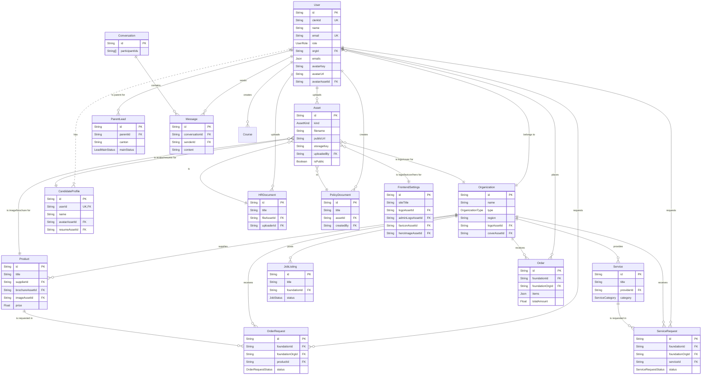

```mermaid
erDiagram
    User {
        String id PK
        String clerkId UK
        String name
        String email UK
        UserRole role
        String orgId FK
        Json emails
        String avatarKey
        String avatarUrl
        String avatarAssetId FK
    }

    Organization {
        String id PK
        String name
        OrganizationType type
        String region
        String logoAssetId FK
        String coverAssetId FK
    }

    Product {
        String id PK
        String title
        String supplierId FK
        String brochureAssetId FK
        String imageAssetId FK
        Float price
    }

    Service {
        String id PK
        String title
        String providerId FK
        ServiceCategory category
    }

    JobListing {
        String id PK
        String title
        String foundationId FK
        JobStatus status
    }

    CandidateProfile {
        String id PK
        String userId UK, FK
        String name
        String avatarAssetId FK
        String resumeAssetId FK
    }

    Asset {
        String id PK
        AssetKind kind
        String filename
        String publicUrl
        String storageKey
        String uploadedBy FK
        Boolean isPublic
    }

    HRDocument {
        String id PK
        String title
        String fileAssetId FK
        String uploaderId FK
    }

    PolicyDocument {
        String id PK
        String title
        String assetId FK
        String createdBy FK
    }

    ParentLead {
        String id PK
        String parentId FK
        String canton
        LeadMainStatus mainStatus
    }

    OrderRequest {
        String id PK
        String foundationId FK
        String foundationOrgId FK
        String productId FK
        OrderRequestStatus status
    }

    ServiceRequest {
        String id PK
        String foundationId FK
        String foundationOrgId FK
        String serviceId FK
        ServiceRequestStatus status
    }

    Order {
        String id PK
        String foundationId FK
        String foundationOrgId FK
        Json items
        Float totalAmount
    }

    Conversation {
        String id PK
        String[] participantIds
    }

    Message {
        String id PK
        String conversationId FK
        String senderId FK
        String content
    }

    FrontendSettings {
        String id PK
        String siteTitle
        String logoAssetId FK
        String adminLogoAssetId FK
        String faviconAssetId FK
        String heroImageAssetId FK
    }

    User ||--o{ Asset : "uploads"
    User ||--o{ Message : "sends"
    User ||--o{ Order : "places"
    User ||--o{ OrderRequest : "requests"
    User ||--o{ ServiceRequest : "requests"
    User ||--o{ ParentLead : "is parent for"
    User ||--o{ HRDocument : "uploads"
    User ||--o{ PolicyDocument : "creates"
    User ||--o{ Course : "creates"
    User }|..|{ CandidateProfile : "has"
    User }o--|| Organization : "belongs to"

    Organization ||--o{ Product : "supplies"
    Organization ||--o{ Service : "provides"
    Organization ||--o{ JobListing : "posts"
    Organization ||--o{ Order : "receives"
    Organization ||--o{ OrderRequest : "receives"
    Organization ||--o{ ServiceRequest : "receives"

    Product ||--o{ OrderRequest : "is requested in"
    Service ||--o{ ServiceRequest : "is requested in"
    Conversation ||--o{ Message : "contains"

    Asset }o--|| HRDocument : "is"
    Asset }o--|| PolicyDocument : "is"
    Asset }o--|| CandidateProfile : "is avatar/resume for"
    Asset }o--|| Product : "is image/brochure for"
    Asset }o--|| Organization : "is logo/cover for"
    Asset }o--|| FrontendSettings: "is logo/favicon/hero for"

```
