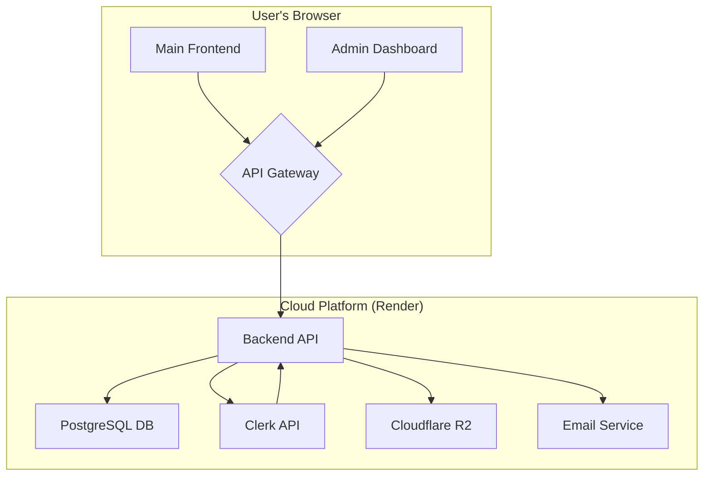
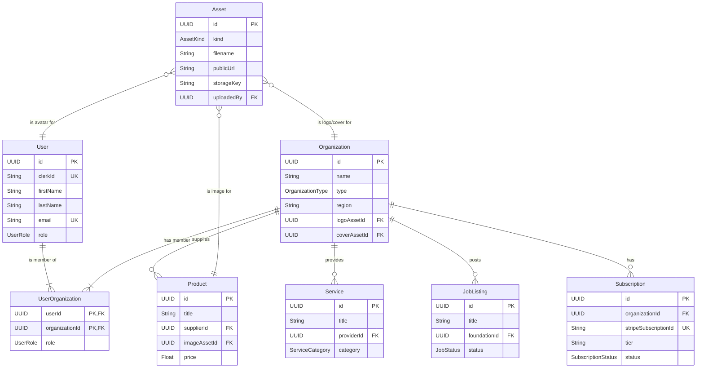

# PC-Solutions Platform Rebuild Specification

## Table of Contents

1.  [Executive Summary](#1-executive-summary)
2.  [Actors & Roles](#2-actors--roles)
3.  [Architecture Overview](#3-architecture-overview)
4.  [Functional Requirements](#4-functional-requirements)
5.  [Non-Functional Requirements](#5-non-functional-requirements)
6.  [Data Model & API Design](#6-data-model--api-design)
7.  [UI / UX Guide](#7-ui--ux-guide)
8.  [Storage & File Handling](#8-storage--file-handling)
9.  [Internationalization](#9-internationalization)
10. [Known Issues & Pain Points (from v1)](#10-known-issues--pain-points-from-v1)
11. [Implementation Roadmap](#11-implementation-roadmap)
12. [Appendix](#12-appendix)

## 1. Executive Summary

**Platform Vision:** To be the leading, all-in-one digital platform for childcare solutions in Switzerland, connecting foundations (daycares), parents, educators, and suppliers of goods and services. The platform will provide a seamless, secure, and user-friendly experience that simplifies management, enhances communication, and fosters a vibrant community.

**Primary Goals:**
*   **Rebuild for Stability & Security:** Create a new platform on a modern, robust architecture that eliminates the security vulnerabilities and technical debt of the current system.
*   **Deliver a World-Class User Experience:** Design an intuitive, consistent, and responsive UI/UX for all user roles.
*   **Enable Commercial Success:** Implement a fully functional subscription and payment system to support the business model.
*   **Foster a Thriving Ecosystem:** Provide the tools and features necessary for all user groups to interact and transact effectively.

**Key User Groups:**
*   **Foundations (Daycares):** The primary customers, who will use the platform to manage their operations, recruit staff, and procure goods and services.
*   **Parents:** End-users looking for childcare services.
*   **Educators/Candidates:** Professionals seeking employment in the childcare sector.
*   **Product Suppliers & Service Providers:** Businesses that offer goods and services to foundations.
*   **Platform Administrators:** Internal users responsible for managing the platform and its users.

## 2. Actors & Roles

This section defines the user roles on the platform and their associated permissions.

| Role | Description | Key Permissions |
|---|---|---|
| **Super Admin** | Has unrestricted access to the entire platform, including the admin dashboard and all backend data. Can manage all users, organizations, and platform settings. | `*` (all permissions) |
| **Admin** | Has access to the admin dashboard. Can manage users, organizations, content, and view platform analytics. Cannot manage other admins or platform-critical settings. | `users:*`, `organizations:*`, `content:*`, `settings:read` |
| **Foundation (Daycare)** | The primary customer role. Manages their organization's profile, staff, job listings, and procurement of goods and services. | `profile:manage(self)`, `jobs:manage(self)`, `orders:create`, `messages:manage` |
| **Product Supplier** | A business that sells products to foundations. Manages their company profile and product listings. | `profile:manage(self)`, `products:manage(self)`, `orders:view(self)`, `messages:manage` |
| **Service Provider** | A business that offers services to foundations. Manages their company profile and service listings. | `profile:manage(self)`, `services:manage(self)`, `requests:view(self)`, `messages:manage` |
| **Educator/Candidate** | A professional seeking employment. Manages their personal profile, CV, and job applications. | `profile:manage(self)`, `jobs:apply` |
| **Parent** | An end-user seeking childcare. Can submit enquiries to foundations. | `profile:manage(self)`, `leads:create`, `messages:manage` |

### Permission Matrix

The following table provides a more detailed breakdown of the permissions for each role across the platform's main pages and API resources.

| Feature / Page / API | Super Admin | Admin | Foundation | Product Supplier | Service Provider | Educator/Candidate | Parent |
|---|---|---|---|---|---|---|---|
| **Admin Dashboard** | **Full Access** | **Full Access** | No Access | No Access | No Access | No Access | No Access |
| `/admin/users` | CRUD | CRUD | - | - | - | - | - |
| `/admin/organizations` | CRUD | CRUD | - | - | - | - | - |
| `/admin/settings` | CRUD | R | - | - | - | - | - |
| **Main Application** | | | | | | | |
| `/settings` | CRUD (self) | CRUD (self) | CRUD (self) | CRUD (self) | CRUD (self) | CRUD (self) | CRUD (self) |
| `/marketplace` | R | R | R | R | R | R | R |
| `POST /api/products` | C | C | - | C (own org) | - | - | - |
| `PUT /api/products/:id` | U | U | - | U (own org) | - | - | - |
| `/recruitment` | R | R | R (own org) | R | R | R | R |
| `POST /api/job-listings` | C | C | C (own org) | - | - | - | - |
| `/parent-leads` | R | R | R (own org) | - | - | - | R (self) |

## 3. Architecture Overview

The rebuilt platform will be based on a modern, scalable, and maintainable architecture.

### Proposed Tech Stack

| Component | Technology | Rationale |
|---|---|---|
| **Monorepo** | Turborepo + pnpm | Provides excellent performance and simplifies dependency management and scripting across multiple packages. |
| **Frontend** | React + Vite + TypeScript | A modern, fast, and type-safe stack for building user interfaces. |
| **UI Framework** | Tailwind CSS + Headless UI | Allows for rapid development of a custom, responsive design system. |
| **Backend** | Node.js + NestJS + TypeScript | NestJS provides a robust, modular, and scalable framework for building backend applications, with excellent support for TypeScript. |
| **Database** | PostgreSQL | A powerful, open-source relational database that offers better data integrity and querying capabilities than MongoDB for this application's data model. |
| **ORM** | Prisma | Provides a type-safe and intuitive way to interact with the database. |
| **Authentication** | Clerk | A secure and feature-rich identity platform that handles all aspects of user authentication. |
| **Storage** | Cloudflare R2 | A cost-effective and S3-compatible object storage solution. |
| **Deployment** | Docker + Render | Docker provides containerization for consistent environments. Render is a modern, easy-to-use cloud platform that supports Docker deployments. |

### Logical Diagram



### Hosting & Deployment Considerations

- **Environments:** The platform will have three environments: `development`, `staging`, and `production`.
- **CI/CD:** A CI/CD pipeline (e.g., using GitHub Actions) will be set up to automatically run tests, linting, and type-checking on every commit. Merges to the `main` branch will trigger a deployment to the `staging` environment. Manual promotion will be required for `production` deployments.
- **Scalability:** The backend API will be designed as a stateless service that can be horizontally scaled by adding more container instances.
- **Domain Strategy:** The platform will be served under the following domain structure:
  - **Public Homepage:** `procrechesolutions.com`
  - **Main Application (Authenticated Users):** `dash.procrechesolutions.com`
  - **Admin Dashboard:** `admin.procrechesolutions.com`

## 4. Functional Requirements

This section details the specific functional requirements for each domain of the platform.

### 4.1. Authentication & Signup

- **User Registration:**
  - Users must be able to sign up using an email and password, or via social providers (Google, Facebook).
  - The signup flow must be multi-step: first select a role, then provide role-specific details.
  - All form inputs must be validated on the client and server.
  - New users must verify their email address before they can log in.
- **User Login:**
  - Users must be able to log in using their email and password, or a social provider.
  - The login form must be protected against brute-force attacks (e.g., with rate limiting and CAPTCHA).
- **Password Management:**
  - Users must be able to reset their password via a secure email link.
  - Logged-in users must be able to change their password.
- **Session Management:**
  - User sessions must be managed securely using JWTs provided by Clerk.
  - The frontend must automatically refresh the session token in the background.
  - Users must be able to log out, which should invalidate the session on both the client and the server.
- **Clerk Integration:**
  - All authentication logic must be handled by Clerk. No custom authentication systems should be built.
  - User data (ID, email, name, role) must be synced from Clerk to the application database.

### 4.2. Profile Management

For a detailed breakdown of the onboarding flow and profile fields for each organization and vendor role, see the following guide:

- **[Organization & Vendor Onboarding Guide](./onboarding-guide.md)**

- **Personal Profile:**
  - All users must be able to view and edit their own personal profile information (first name, last name).
  - All users must be able to upload a profile avatar.
    - Avatars must be images (JPEG, PNG, GIF, WebP).
    - Avatars must be less than 5MB.
    - Avatars should be resized to standard dimensions (e.g., 256x256) on the backend before being stored.
- **Organization Profile (for Foundations, Suppliers, Service Providers):**
  - Users with the appropriate role must be able to manage their organization's profile.
  - This includes company name, logo, cover image, "about" text, VAT number, regions served, and languages spoken.
  - Logo and cover image uploads must follow the same validation rules as avatars.
- **Candidate Profile (for Educators/Candidates):**
  - Educators must be able to manage their professional profile, including:
    - Work experience
    - Education
    - Certifications
    - Skills
    - Availability
    - A CV/resume document (PDF or DOCX, < 10MB).

### 4.3. Subscription & Paywall Logic

For a detailed breakdown of the subscription tiers and features for each role, see the following guide:

- **[Subscription Guide](./subscription-guide.md)**

- **Subscription Tiers:**
  - The platform will have multiple subscription tiers for different user roles (e.g., Basic, Essential, Professional for Foundations).
  - Each tier will have a defined set of features and usage limits (e.g., number of parent enquiries, number of job listings).
- **Feature Gating:**
  - The UI must dynamically show or hide features based on the user's subscription plan.
  - The backend API must enforce these limits. Requests to access features or resources that are not included in the user's plan must be rejected with a 403 Forbidden status.
- **Billing & Payments:**
  - The platform must integrate with a payment provider (e.g., Stripe) to handle recurring subscription payments.
  - Users must be able to upgrade or downgrade their subscription plan.
  - Users must be able to view their billing history and manage their payment methods.

### 4.4. Marketplace & Procurement

- **Product & Service Listings:**
  - Suppliers and Service Providers must be able to create, update, and delete listings for their products and services.
  - Listings must include a title, description, category, tags, images, and pricing information.
- **Browsing & Searching:**
  - All users must be able to browse and search the marketplace.
  - Search results must be filterable by category, price, location, etc.
- **Ordering & Requests:**
  - Foundations must be able to place orders for products and make requests for services.
  - Suppliers and Service Providers must be able to view and manage incoming orders and requests.

### 4.5. Recruitment

- **Job Listings:**
  - Foundations must be able to create, update, and delete job listings.
- **Job Board:**
  - Educators/Candidates must be able to browse and search for job listings.
- **Applications:**
  - Educators/Candidates must be able to apply for jobs directly through the platform.
  - Foundations must be able to view and manage incoming applications.

### 4.6. Content Management

- **Content Types:**
  - Admins must be able to create, update, and delete various types of content, including HR documents, e-learning courses, and state policies.
- **Content Access:**
  - Content can be made available to all users or restricted to specific roles.

### 4.7. Messaging

- **Conversations:**
  - Users must be able to initiate conversations with other users (e.g., a foundation messaging a candidate).
- **Real-time Chat:**
  - The messaging interface should support real-time chat with unread message indicators.
- **Attachments:**
  - Users must be able to send file attachments in messages.

### 4.8. Admin Dashboard

- **User Management:** Admins must be able to view, create, update, and delete all users.
- **Organization Management:** Admins must be able to view, create, update, and delete all organizations.
- **Content Moderation:** Admins must be able to review and approve user-generated content (e.g., product listings, job listings).
- **Platform Settings:** Admins must be able to manage platform-wide settings (e.g., site branding, integrations).

For a detailed breakdown of new admin features, see the following guide:

- **[New Features Guide](./new-features-guide.md)**

### 4.9. Role-Based Dashboards & Settings

For a detailed breakdown of the dashboards for each role and the shared settings pages, see the following guide:

- **[Role-Based Dashboards & Settings Guide](./dashboards-guide.md)**

## 5. Non-Functional Requirements

This section defines the quality attributes and constraints of the system.

- **Performance:**
  - **API Response Time:** p95 latency for all API endpoints must be < 200ms. p99 latency must be < 500ms.
  - **Page Load Time:** Largest Contentful Paint (LCP) for all key pages must be < 2.5 seconds.
  - **Concurrency:** The system must be able to handle at least 1000 concurrent users without performance degradation.
- **Security:**
  - The platform must be protected against the OWASP Top 10 vulnerabilities.
  - All data in transit must be encrypted with TLS 1.2 or higher.
  - All sensitive data at rest (e.g., user passwords, API keys) must be encrypted.
  - RBAC must be enforced on the server-side for all API endpoints.
  - All user-generated content must be sanitized to prevent XSS attacks.
  - All external dependencies must be regularly scanned for vulnerabilities.
- **Reliability & Monitoring:**
  - The platform must have an uptime of at least 99.9%.
  - All services must produce structured, centralized logs with request IDs.
  - A monitoring and alerting system (e.g., using Prometheus and Grafana) must be in place to track key metrics (e.g., error rates, latency, resource usage) and alert the team of any issues.
- **Test Strategy:**
  - **Unit Tests:** All critical business logic, UI components, and utility functions must have unit tests with at least 80% code coverage.
  - **Integration Tests:** The interaction between different parts of the system (e.g., API and database) must be covered by integration tests.
  - **End-to-End (E2E) Tests:** The critical user flows (e.g., signup, login, placing an order) must be covered by E2E tests.
- **CI/CD:**
  - A full suite of tests (unit, integration) must be run automatically on every pull request.
  - Code must not be merged if the tests fail or if the code does not meet the defined quality standards (e.g., linting, type-checking).
- **Scalability:**
  - The architecture must be designed to be scalable. The backend should be a stateless service that can be horizontally scaled.

## 6. Data Model & API Design

### 6.1. ER Diagram

This diagram outlines the main entities in the system and their relationships.



### 6.2. API Design

The API will be a RESTful API with clear, resource-oriented URLs. All API responses will use a consistent JSON format.

**Standard Response Format:**
```json
{
  "success": true,
  "message": "Resource retrieved successfully",
  "data": { ... },
  "pagination": { ... } // Optional
}
```

**Authentication:**
- All endpoints that require authentication must expect a JWT in the `Authorization` header.
- The API will use Clerk's libraries to validate the JWT.

**API Endpoints:**

| Method | Endpoint | Description | Auth Required | RBAC |
|---|---|---|---|---|
| **Auth** | | | | |
| `POST` | `/auth/signup` | Register a new user | No | - |
| `POST` | `/auth/login` | Log in a user | No | - |
| `POST` | `/auth/logout` | Log out a user | Yes | - |
| `POST` | `/auth/forgot-password` | Send a password reset email | No | - |
| **Users** | | | | |
| `GET` | `/users/me` | Get the current user's profile | Yes | - |
| `PUT` | `/users/me` | Update the current user's profile | Yes | - |
| `GET` | `/users` | Get a list of all users | Yes | Admin |
| `GET` | `/users/:id` | Get a single user by ID | Yes | Admin |
| **Organizations** | | | | |
| `GET` | `/organizations` | Get a list of organizations | Yes | - |
| `POST` | `/organizations` | Create a new organization | Yes | Admin |
| `GET` | `/organizations/:id` | Get a single organization by ID | Yes | - |
| `PUT` | `/organizations/:id` | Update an organization | Yes | Admin, Owner |
| **Products** | | | | |
| `GET` | `/products` | Get a list of products | No | - |
| `POST` | `/products` | Create a new product | Yes | Supplier, Admin |
| `GET` | `/products/:id` | Get a single product by ID | No | - |
| `PUT` | `/products/:id` | Update a product | Yes | Supplier, Admin |
| **...and so on for all other resources.** | | | | |

## 7. UI / UX Guide

A detailed UI/UX guide, including a site map, wireframe descriptions, and content management UI instructions, has been created and is available at the following location:

- **[Full UI/UX Guide](./ui-guide.md)**

The key principles are:
- **Site Map:** A clear and logical site map will be implemented.
- **Wireframes:** The application will be built based on detailed wireframes for all key user flows.
- **Accessibility:** The application must be accessible and comply with WCAG 2.1 AA standards.
- **Responsive Design:** All pages must be fully responsive and usable on mobile, tablet, and desktop devices.

## 8. Storage & File Handling

- **Storage:** All user-uploaded files (avatars, logos, documents) will be stored in Cloudflare R2.
- **URLs:** Public assets will be served directly from R2 via a custom domain. Private assets will be served using signed URLs with a short expiration time.
- **Validation:** All file uploads will be validated on the backend for file type, size, and malicious content.

## 9. Internationalization

The detailed specification for the internationalization (i18n) system, covering both static UI text and dynamic user-generated content, can be found in the following document:

- **[Full i18n Specification](./i18n-specification.md)**

The key principles are:
- **Static Text:** All static UI text will be managed in JSON files and translated using `i18next`.
- **Dynamic Content:** The database schema will support storing dynamic content (e.g., product descriptions) in multiple languages, with a clear fallback strategy.

## 10. Known Issues & Pain Points (from v1)

- **Authentication:** The v1 auth system was a broken, inconsistent mix of Clerk and a custom implementation.
- **Security:** The v1 application had critical security vulnerabilities.
- **Testing:** The v1 application had no meaningful test coverage.
- **Technical Debt:** The v1 codebase was plagued by technical debt, including a broken monorepo setup and outdated dependencies.

## 11. Implementation Roadmap

- **Phase 1 (Days 1-30):** Core auth, roles, profile, subscription.
- **Phase 2 (Days 31-60):** Listings/products/services + messaging + uploads.
- **Phase 3 (Days 61-90):** Admin tooling, analytics, polish, CI/CD hardening.

## 12. Appendix

- **Glossary:** A glossary of terms will be created.
- **Environment Variables:** A comprehensive list of all required environment variables will be maintained.
- **Dependencies:** A list of all third-party dependencies will be maintained.
